# Diagrama Entidad-Relación Completo - Sistema de Email Marketing

## Descripción General

Este diagrama representa el modelo de datos completo del sistema de gestión de campañas de email marketing. El diseño incluye todos los módulos del sistema:

- **Seguridad**: Usuarios y sesiones
- **Campañas**: Gestión de campañas de correo electrónico
- **Plantillas**: Plantillas HTML reutilizables
- **Adjuntos**: Archivos PDF adjuntos a campañas
- **Gestión de Contactos**: Archivos de contactos con validaciones
- **Listas de Emails**: Listas negra, blanca y de cancelación de suscripciones

## Características Clave del Diseño

✅ **NO incluye tabla de emails individuales**: Los emails se gestionan mediante archivos CSV  
✅ **Gestión dual de archivos**: Archivo original + archivo procesado con validaciones  
✅ **Trazabilidad completa**: Auditoría de creadores y fechas  
✅ **Estadísticas integradas**: Contadores de validación en `upload_batches`  
✅ **Relaciones N:M**: Reutilización de plantillas, adjuntos y batches de contactos  

## Diagrama ER

```mermaid
erDiagram
    %% ========================================
    %% MÓDULO DE SEGURIDAD Y USUARIOS
    %% ========================================
    
    users {
        BIGINT id PK
        VARCHAR(50) username UK "NOT NULL"
        VARCHAR(255) password_hash "NOT NULL, BCrypt"
        VARCHAR(100) email UK "NOT NULL"
        VARCHAR(100) first_name
        VARCHAR(100) last_name
        VARCHAR(20) role "NOT NULL, ADMIN/USER"
        BIT is_active "DEFAULT 1"
        DATETIME last_login
        DATETIME created_at "DEFAULT GETDATE()"
        DATETIME updated_at
    }
    
    sessions {
        BIGINT id PK
        BIGINT user_id FK "NOT NULL"
        VARCHAR(255) token UK "NOT NULL, UUID"
        DATETIME expires_at "NOT NULL"
        DATETIME created_at "DEFAULT GETDATE()"
    }
    
    %% ========================================
    %% MÓDULO DE CAMPAÑAS
    %% ========================================
    
    campaigns {
        BIGINT id PK
        VARCHAR(255) name "NOT NULL"
        VARCHAR(1000) description
        VARCHAR(255) subject "NOT NULL, Email subject"
        BIGINT created_by FK "NOT NULL"
        VARCHAR(20) status "NOT NULL, DRAFT/SCHEDULED/IN_PROGRESS/PAUSED/COMPLETED/FAILED"
        DATETIME scheduled_at "Fecha programada de envío"
        DATETIME started_at
        DATETIME completed_at
        INT total_emails "Total de emails a enviar"
        INT sent_emails "Emails enviados exitosamente"
        INT failed_emails "Emails fallidos"
        DECIMAL(5_2) success_rate "Porcentaje de éxito"
        DATETIME created_at "DEFAULT GETDATE()"
        DATETIME updated_at
    }
    
    %% ========================================
    %% MÓDULO DE PLANTILLAS HTML
    %% ========================================
    
    templates {
        BIGINT id PK
        VARCHAR(255) name "NOT NULL"
        VARCHAR(500) description
        TEXT html_content "NOT NULL"
        BIGINT created_by FK "NOT NULL"
        BIT is_responsive "DEFAULT 1"
        BIT is_active "DEFAULT 1"
        DATETIME created_at "DEFAULT GETDATE()"
        DATETIME updated_at
    }
    
    %% ========================================
    %% MÓDULO DE ARCHIVOS ADJUNTOS
    %% ========================================
    
    attachments {
        BIGINT id PK
        VARCHAR(255) file_name "NOT NULL"
        VARCHAR(255) original_name "NOT NULL"
        VARCHAR(500) file_path "NOT NULL"
        VARCHAR(50) content_type "NOT NULL, application/pdf"
        BIGINT file_size "NOT NULL, bytes"
        BIGINT uploaded_by FK "NOT NULL"
        VARCHAR(500) description
        DATETIME created_at "DEFAULT GETDATE()"
        DATETIME updated_at
    }
    
    %% ========================================
    %% MÓDULO DE GESTIÓN DE ARCHIVOS DE CONTACTOS
    %% ========================================
    
    upload_batches {
        BIGINT id PK
        VARCHAR(255) original_file_name "NOT NULL"
        VARCHAR(500) original_file_path "NOT NULL, Archivo original subido"
        VARCHAR(500) output_file_path "NOT NULL, CSV con emails válidos"
        BIGINT uploaded_by FK "NOT NULL"
        DATETIME uploaded_at "NOT NULL, DEFAULT GETDATE()"
        INT total_records "NOT NULL, Total en archivo original"
        INT valid_records "NOT NULL, Pasaron todas validaciones"
        INT duplicate_records "NOT NULL"
        INT invalid_format_records "NOT NULL"
        INT daci_rejected_records "NOT NULL"
        INT blacklisted_records "NOT NULL"
        INT unsubscribed_records "NOT NULL"
        DECIMAL(5_2) validation_rate "NOT NULL, Porcentaje de validación"
        VARCHAR(20) status "NOT NULL, PROCESSING/COMPLETED/FAILED"
        BIGINT processing_time_ms
        VARCHAR(1000) error_message
        DATETIME created_at "DEFAULT GETDATE()"
    }
    
    %% ========================================
    %% MÓDULO DE LISTAS DE EMAILS
    %% ========================================
    
    fatal_emails {
        BIGINT id PK
        VARCHAR(255) email UK "NOT NULL, Lista negra"
        VARCHAR(500) reason "Motivo de inclusión"
        VARCHAR(50) source "MANUAL/BOUNCE/COMPLAINT/SPAM"
        DATETIME added_at "DEFAULT GETDATE()"
        VARCHAR(100) added_by "Usuario o sistema que agregó"
    }
    
    unsubscribe_list {
        BIGINT id PK
        VARCHAR(255) email UK "NOT NULL, Canceló suscripción"
        VARCHAR(500) reason
        VARCHAR(50) method "LINK/MANUAL/API"
        BIGINT campaign_id FK "Campaña desde donde se canceló"
        DATETIME unsubscribed_at "DEFAULT GETDATE()"
    }
    
    valid_contacts {
        BIGINT id PK
        VARCHAR(255) email UK "NOT NULL, Lista blanca"
        VARCHAR(100) first_name
        VARCHAR(100) last_name
        VARCHAR(50) validation_method "DACI/MANUAL/UPLOAD"
        DATETIME validated_at "DEFAULT GETDATE()"
        DATETIME last_validation "Última revalidación"
        BIT is_active "DEFAULT 1"
    }
    
    %% ========================================
    %% TABLAS INTERMEDIAS (N:M)
    %% ========================================
    
    campaign_templates {
        BIGINT id PK
        BIGINT campaign_id FK "NOT NULL"
        BIGINT template_id FK "NOT NULL"
        DATETIME assigned_at "DEFAULT GETDATE()"
    }
    
    campaign_attachments {
        BIGINT id PK
        BIGINT campaign_id FK "NOT NULL"
        BIGINT attachment_id FK "NOT NULL"
        DATETIME assigned_at "DEFAULT GETDATE()"
    }
    
    campaign_upload_batches {
        BIGINT id PK
        BIGINT campaign_id FK "NOT NULL"
        BIGINT upload_batch_id FK "NOT NULL"
        INT emails_to_send "Emails de este batch para la campaña"
        DATETIME assigned_at "DEFAULT GETDATE()"
    }
    
    %% ========================================
    %% RELACIONES
    %% ========================================
    
    %% Usuarios y Sesiones
    users ||--o{ sessions : "tiene"
    
    %% Usuarios como creadores
    users ||--o{ campaigns : "crea"
    users ||--o{ templates : "crea"
    users ||--o{ attachments : "sube"
    users ||--o{ upload_batches : "carga"
    
    %% Campañas con plantillas (N:M)
    campaigns ||--o{ campaign_templates : "usa"
    templates ||--o{ campaign_templates : "usado_en"
    
    %% Campañas con adjuntos (N:M)
    campaigns ||--o{ campaign_attachments : "incluye"
    attachments ||--o{ campaign_attachments : "adjunto_en"
    
    %% Campañas con batches de contactos (N:M)
    campaigns ||--o{ campaign_upload_batches : "envía_a"
    upload_batches ||--o{ campaign_upload_batches : "usado_en"
    
    %% Cancelaciones de suscripción relacionadas con campañas
    campaigns ||--o{ unsubscribe_list : "generó_cancelación"
```



## Descripción de Entidades

### 1. **users** (Tabla de Usuarios)
Almacena los usuarios del sistema con autenticación mediante BCrypt.

**Casos de Uso Relacionados:**
- CU-001: Crear usuario
- CU-002: Buscar usuario por username
- CU-003: Actualizar usuario por username
- CU-004: Actualizar última fecha de login por username

**Campos clave:**
- `username`: Único, para login
- `password_hash`: Hash BCrypt del password
- `role`: ADMIN o USER

---

### 2. **sessions** (Sesiones de Usuario)
Gestiona las sesiones activas de los usuarios con tokens UUID.

**Casos de Uso Relacionados:**
- CU-005: Crear sesión por usuario
- CU-006: Buscar sesión por id
- CU-007: Actualizar fecha de expiración de la sesión por id
- CU-008: Eliminar sesión por id

**Campos clave:**
- `token`: UUID único para identificar la sesión
- `expires_at`: Fecha de expiración (30 minutos por defecto)

---

### 3. **campaigns** (Campañas de Email Marketing)
Almacena las campañas de correo electrónico con su estado y estadísticas.

**Casos de Uso Relacionados:**
- CU-009: Crear nueva campaña de correo electrónico
- CU-010: Buscar campaña de correo electrónico por id
- CU-012: Recuperar campañas ordenadas por fecha de creación y paginadas
- CU-013: Una campaña puede actualizarse en estatus DRAFT, SCHEDULED
- CU-014: Una campaña IN_PROGRESS puede pausarse
- CU-015: Una campaña COMPLETED no puede modificarse
- CU-016: Una campaña se puede Pausar/Reanudar su ejecución

**Estados posibles:**
- `DRAFT`: Borrador editable
- `SCHEDULED`: Programada para envío futuro
- `IN_PROGRESS`: En proceso de envío
- `PAUSED`: Pausada temporalmente
- `COMPLETED`: Finalizada exitosamente
- `FAILED`: Falló durante el envío

**Campos estadísticos:**
- `total_emails`: Total de destinatarios
- `sent_emails`: Enviados exitosamente
- `failed_emails`: Fallidos
- `success_rate`: Tasa de éxito

---

### 4. **templates** (Plantillas HTML)
Plantillas reutilizables para los correos electrónicos.

**Casos de Uso Relacionados:**
- CU-017: Crear plantilla de correo electrónico HTML
- CU-018: Buscar plantilla de correo electrónico HTML por id
- CU-019: Recuperar plantillas por fecha de creación y paginación
- CU-020: Editar plantilla de correo electrónico HTML

**Campos clave:**
- `html_content`: Contenido HTML de la plantilla (TEXT)
- `is_responsive`: Indica si es responsive
- `is_active`: Permite desactivar plantillas sin eliminarlas

---

### 5. **attachments** (Archivos Adjuntos)
Gestiona archivos PDF adjuntos a las campañas.

**Casos de Uso Relacionados:**
- CU-021: Crear archivo adjunto
- CU-022: Buscar archivo adjunto por id
- CU-023: Recuperar adjunto por fecha de creación y paginación
- CU-024: Editar archivo adjunto

**Campos clave:**
- `file_name`: Nombre único generado en el sistema
- `original_name`: Nombre original del archivo
- `file_path`: Ruta en el sistema de archivos
- `file_size`: Tamaño en bytes (máximo 10MB)

---

### 6. **upload_batches** (Batches de Carga de Contactos)
**TABLA CENTRAL** para la gestión de archivos de contactos. Almacena tanto el archivo original como el archivo procesado con las validaciones aplicadas.

**Casos de Uso Relacionados:**
- CU-025: Cargar base de datos de emails (archivos)
- CU-026: Detectar correos duplicados en el mismo archivo
- CU-027: Validar correos electrónicos (formato)
- CU-028: Adaptador de sistema DACI
- CU-029: Validar correos electrónicos con sistema DACI
- CU-030: Validar correos electrónicos con lista negra
- CU-031: Validar correos electrónicos con lista de cancelación de suscripciones

**Campos clave:**
- `original_file_path`: Ruta al archivo original subido (TXT/XLS/XLSM)
- `output_file_path`: Ruta al CSV generado con emails validados
- `total_records`: Total de emails en archivo original
- `valid_records`: Emails que pasaron todas las validaciones
- `duplicate_records`: Duplicados encontrados en el archivo
- `invalid_format_records`: Formato inválido (RFC 5322)
- `daci_rejected_records`: Rechazados por sistema DACI
- `blacklisted_records`: Encontrados en lista negra
- `unsubscribed_records`: Que cancelaron suscripción
- `validation_rate`: Porcentaje de validación
- `status`: PROCESSING, COMPLETED, FAILED

**Importante:**
- NO se almacenan emails individuales en la base de datos
- Los emails válidos se guardan en un archivo CSV referenciado en `output_file_path`
- Permite reutilizar el mismo batch en múltiples campañas

---

### 7. **fatal_emails** (Lista Negra)
Emails bloqueados permanentemente del sistema.

**Casos de Uso Relacionados:**
- CU-032: Crear correo electrónico en lista negra
- CU-031: Buscar correo electrónico en lista negra

**Orígenes posibles:**
- `MANUAL`: Agregado manualmente
- `BOUNCE`: Rebote permanente
- `COMPLAINT`: Queja de spam
- `SPAM`: Detectado como spam

---

### 8. **unsubscribe_list** (Lista de Cancelación de Suscripciones)
Emails que solicitaron dejar de recibir correos.

**Casos de Uso Relacionados:**
- CU-032: Crear correo electrónico que canceló su suscripción
- CU-033: Buscar correo electrónico que canceló su suscripción

**Métodos de cancelación:**
- `LINK`: Mediante link de unsubscribe
- `MANUAL`: Manualmente por administrador
- `API`: Mediante API externa

---

### 9. **valid_contacts** (Lista Blanca)
Emails que han pasado todas las validaciones.

**Casos de Uso Relacionados:**
- CU-034: Crear correo electrónico que pasó todas sus validaciones
- CU-034: Buscar correo electrónico que pasó todas sus validaciones

**Métodos de validación:**
- `DACI`: Validado por sistema DACI
- `MANUAL`: Validado manualmente
- `UPLOAD`: Validado durante carga de archivo

---

### 10. **campaign_templates** (Relación N:M)
Relaciona campañas con plantillas HTML. Una campaña puede usar múltiples plantillas (útil para A/B testing).

---

### 11. **campaign_attachments** (Relación N:M)
Relaciona campañas con archivos adjuntos. Una campaña puede tener múltiples PDFs adjuntos.

---

### 12. **campaign_upload_batches** (Relación N:M)
Relaciona campañas con batches de contactos. Una campaña puede usar múltiples batches y un batch puede reutilizarse en múltiples campañas.

**Campo adicional:**
- `emails_to_send`: Cantidad de emails de este batch a enviar en la campaña

---

## Índices Recomendados

### Índices Únicos
```sql
CREATE UNIQUE INDEX idx_users_username ON users(username);
CREATE UNIQUE INDEX idx_users_email ON users(email);
CREATE UNIQUE INDEX idx_sessions_token ON sessions(token);
CREATE UNIQUE INDEX idx_fatal_emails_email ON fatal_emails(email);
CREATE UNIQUE INDEX idx_unsubscribe_list_email ON unsubscribe_list(email);
CREATE UNIQUE INDEX idx_valid_contacts_email ON valid_contacts(email);
```

### Índices de Búsqueda
```sql
-- Sesiones
CREATE INDEX idx_sessions_user_id ON sessions(user_id);
CREATE INDEX idx_sessions_expires_at ON sessions(expires_at);

-- Campañas
CREATE INDEX idx_campaigns_status ON campaigns(status);
CREATE INDEX idx_campaigns_created_by ON campaigns(created_by);
CREATE INDEX idx_campaigns_scheduled_at ON campaigns(scheduled_at);
CREATE INDEX idx_campaigns_created_at ON campaigns(created_at);

-- Plantillas
CREATE INDEX idx_templates_created_by ON templates(created_by);
CREATE INDEX idx_templates_is_active ON templates(is_active);
CREATE INDEX idx_templates_created_at ON templates(created_at);

-- Adjuntos
CREATE INDEX idx_attachments_uploaded_by ON attachments(uploaded_by);
CREATE INDEX idx_attachments_created_at ON attachments(created_at);

-- Upload Batches
CREATE INDEX idx_upload_batches_uploaded_by ON upload_batches(uploaded_by);
CREATE INDEX idx_upload_batches_status ON upload_batches(status);
CREATE INDEX idx_upload_batches_uploaded_at ON upload_batches(uploaded_at);

-- Listas de emails
CREATE INDEX idx_fatal_emails_added_at ON fatal_emails(added_at);
CREATE INDEX idx_unsubscribe_list_campaign_id ON unsubscribe_list(campaign_id);
CREATE INDEX idx_unsubscribe_list_unsubscribed_at ON unsubscribe_list(unsubscribed_at);
CREATE INDEX idx_valid_contacts_validated_at ON valid_contacts(validated_at);
CREATE INDEX idx_valid_contacts_is_active ON valid_contacts(is_active);
```

### Índices Compuestos
```sql
-- Campañas por usuario y estado
CREATE INDEX idx_campaigns_user_status ON campaigns(created_by, status);

-- Sesiones activas por usuario
CREATE INDEX idx_sessions_user_expires ON sessions(user_id, expires_at);

-- Upload batches por usuario y estado
CREATE INDEX idx_upload_batches_user_status ON upload_batches(uploaded_by, status);
```

---

## Flujo de Procesamiento de Contactos

### 1. Carga de Archivo
```
Usuario sube archivo (TXT/XLS/XLSM)
    ↓
Sistema parsea y extrae emails
    ↓
Se crean contadores: total, duplicados, formatoInvalido, etc.
```

### 2. Validaciones en Memoria
```
Para cada email:
    ├─ ¿Es duplicado? → SÍ: duplicados++, siguiente email
    ├─ ¿Formato válido? → NO: formatoInvalido++, siguiente email
    ├─ ¿Válido en DACI? → NO: daciInvalido++, siguiente email
    ├─ ¿En lista negra? → SÍ: enListaNegra++, siguiente email
    ├─ ¿Canceló suscripción? → SÍ: canceloSuscripcion++, siguiente email
    └─ ✅ VÁLIDO → Agregar a lista validContacts en memoria
```

### 3. Persistencia
```
Generar archivo CSV con validContacts
    ↓
Guardar CSV en /uploads/contact-lists/contactos_validos_TIMESTAMP.csv
    ↓
Crear UN registro en upload_batches con:
    - original_file_path (archivo subido)
    - output_file_path (CSV generado)
    - Todas las estadísticas
    ↓
Retornar resumen al cliente
```

### 4. Uso en Campañas
```
Al crear/ejecutar campaña:
    ↓
Seleccionar uno o más upload_batches
    ↓
Crear registros en campaign_upload_batches
    ↓
Leer CSV desde output_file_path
    ↓
Enviar emails a los contactos válidos
```

---

## Ventajas de este Diseño

✅ **Performance**: No hay inserts masivos de emails durante la carga  
✅ **Escalabilidad**: Archivos CSV son más eficientes que millones de registros  
✅ **Reutilización**: Un batch puede usarse en múltiples campañas  
✅ **Auditoría**: Historial completo de cargas con estadísticas  
✅ **Flexibilidad**: Procesamiento asíncrono de archivos  
✅ **Trazabilidad**: Cada carga tiene ID único y metadatos completos  
✅ **Eficiencia**: Evita duplicación de datos en base de datos  
✅ **Mantenibilidad**: Estructura clara y normalizada  

---

## Queries Útiles

### Obtener batches listos para una campaña
```sql
SELECT id, output_file_path, valid_records, validation_rate
FROM upload_batches
WHERE status = 'COMPLETED'
  AND valid_records > 0
ORDER BY uploaded_at DESC;
```

### Estadísticas de validación del último mes
```sql
SELECT 
    COUNT(*) as total_uploads,
    SUM(total_records) as total_emails_processed,
    SUM(valid_records) as total_valid_emails,
    AVG(validation_rate) as avg_validation_rate,
    SUM(duplicate_records) as total_duplicates,
    SUM(blacklisted_records) as total_blacklisted
FROM upload_batches
WHERE status = 'COMPLETED'
  AND uploaded_at >= DATEADD(MONTH, -1, GETDATE());
```

### Campañas activas con sus plantillas
```sql
SELECT 
    c.id,
    c.name,
    c.status,
    t.name as template_name,
    t.id as template_id
FROM campaigns c
INNER JOIN campaign_templates ct ON c.id = ct.campaign_id
INNER JOIN templates t ON ct.template_id = t.id
WHERE c.status IN ('SCHEDULED', 'IN_PROGRESS');
```

### Emails con mayor rechazo
```sql
SELECT TOP 10
    original_file_name,
    total_records,
    valid_records,
    (total_records - valid_records) as rejected,
    validation_rate,
    uploaded_at
FROM upload_batches
WHERE status = 'COMPLETED'
ORDER BY (total_records - valid_records) DESC;
```

---

## Casos de Uso Cubiertos

✅ **Módulo de Seguridad**: CU-001 a CU-008  
✅ **Módulo de Campañas**: CU-009 a CU-016  
✅ **Módulo de Plantillas**: CU-017 a CU-020  
✅ **Módulo de Adjuntos**: CU-021 a CU-024  
✅ **Módulo de Gestión de Emails**: CU-025 a CU-031  
✅ **Módulo de Lista Negra**: CU-032, CU-031  
✅ **Módulo de Cancelaciones**: CU-032, CU-033  
✅ **Módulo de Lista Blanca**: CU-034  

---

## Notas Finales

Este diseño de base de datos está optimizado para:
- Alto volumen de emails (millones)
- Reutilización de recursos (plantillas, adjuntos, batches)
- Auditoría completa (quién, cuándo, qué)
- Validaciones múltiples (formato, DACI, listas)
- Procesamiento eficiente (archivos CSV vs registros individuales)

El modelo es escalable, mantenible y cumple con todos los casos de uso especificados.

