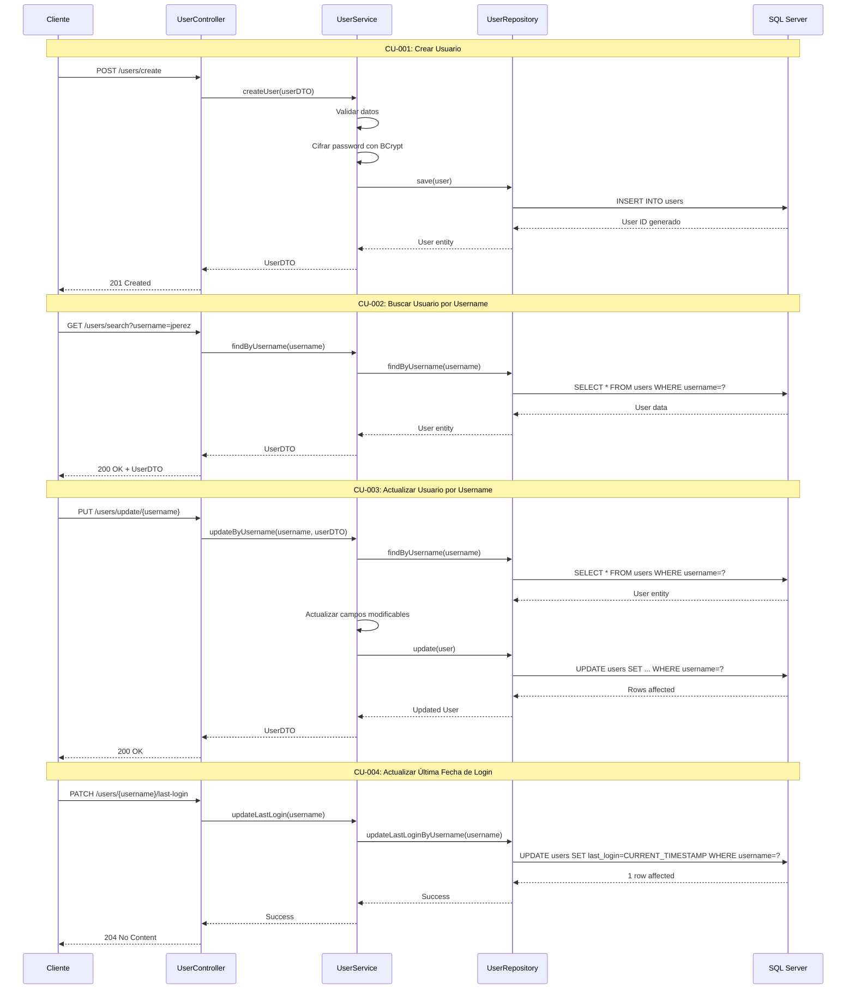

# Módulo 1: Gestión de Usuarios

## Casos de Uso
- CU-001: Crear usuario
- CU-002: Buscar usuario por username
- CU-003: Actualizar usuario por username
- CU-004: Actualizar última fecha de login por username

## Diagrama de Secuencia

