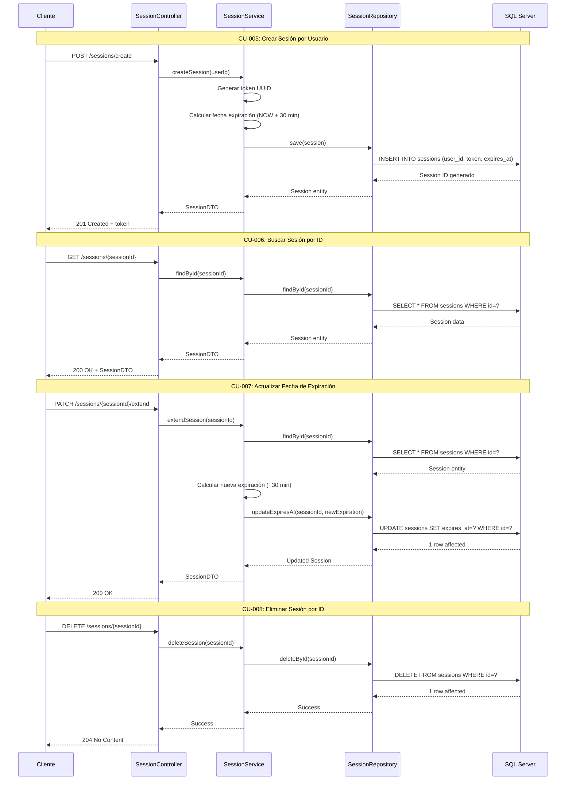

# Módulo 2: Gestión de Sesiones

## Casos de Uso
- CU-005: Crear sesión por usuario
- CU-006: Buscar sesión por id
- CU-007: Actualizar fecha de expiración de la sesión por id
- CU-008: Eliminar sesión por id

## Diagrama de Secuencia

