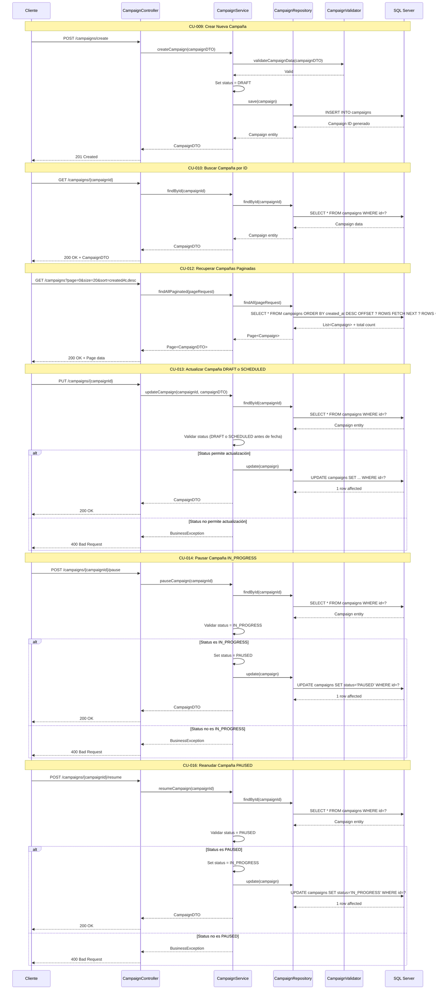

# Módulo 3: Gestión de Campañas

## Casos de Uso
- CU-009: Crear nueva campaña de correo electrónico
- CU-010: Buscar campaña de correo electrónico por id
- CU-012: Recuperar campañas de correo electrónico ordenado por fecha de creación y paginado
- CU-013: Una campaña puede actualizarse en estatus DRAFT, SCHEDULED (Antes de la fecha de ejecución)
- CU-014: Una campaña IN_PROGRESS puede pausarse
- CU-015: Una campaña COMPLETED no puede modificarse
- CU-016: Una campaña se puede Pausar/Reanudar su ejecución

## Diagrama de Secuencia

