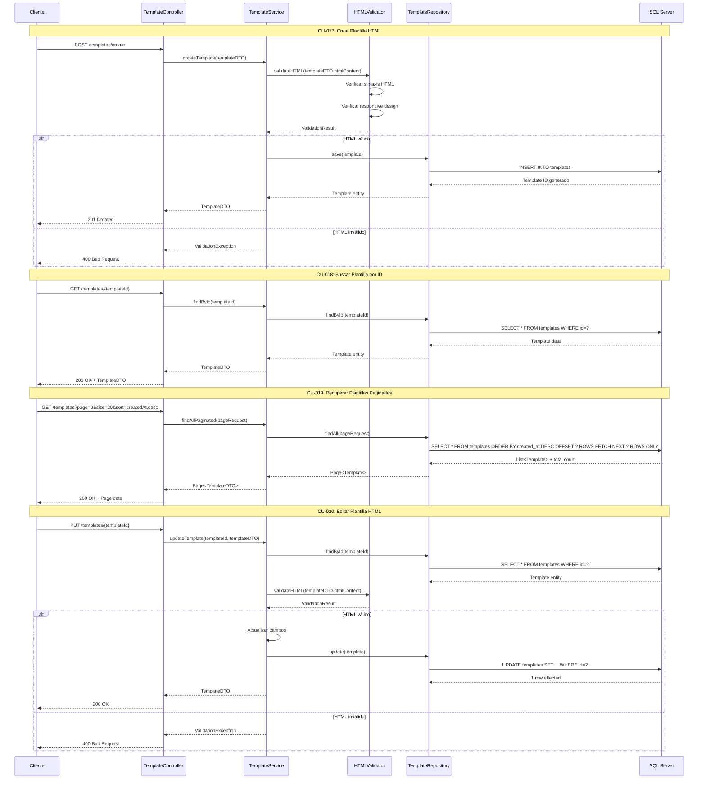

# Módulo 4: Gestión de Plantillas HTML

## Casos de Uso
- CU-017: Crear plantilla de correo electrónico HTML
- CU-018: Buscar plantilla de correo electrónico HTML por id
- CU-019: Recuperar plantillas de correo electrónico HTML por fecha de creación y paginación
- CU-020: Editar plantilla de correo electrónico HTML

## Diagrama de Secuencia

