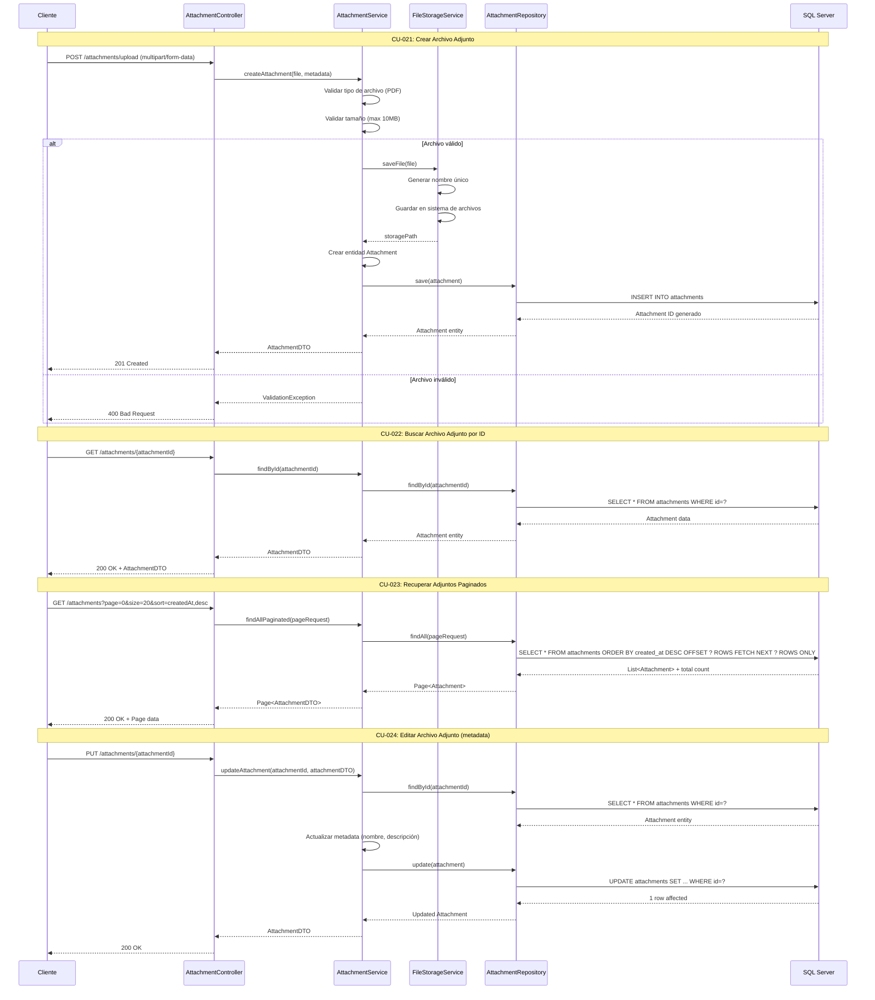

# Módulo 5: Gestión de Archivos Adjuntos

## Casos de Uso
- CU-021: Crear archivo adjunto
- CU-022: Buscar archivo adjunto por id
- CU-023: Recuperar adjunto por fecha de creación y paginación
- CU-024: Editar archivo adjunto

## Diagrama de Secuencia

