# Módulo 6: Gestión de Bases de Datos de Emails

## Casos de Uso
- CU-025: Cargar base de datos de emails (archivos)
- CU-026: Detectar correos duplicados dentro del mismo archivo
- CU-027: Validar correos electrónicos (formato)
- CU-028: Adaptador de sistema DACI
- CU-029: Validar correos electrónicos con sistema DACI
- CU-030: Validar correos electrónicos con lista negra
- CU-031: Validar correos electrónicos con lista de cancelación de suscripciones

## Notas Importantes

### Detección de Duplicados
La detección de duplicados (CU-026) se realiza en memoria usando un `Set<String>`. Solo se procesa la **primera ocurrencia** de cada email, todas las ocurrencias duplicadas subsecuentes se descartan automáticamente.

### Manejo de Validaciones
- Los contactos que **NO pasan** alguna validación son **descartados** (no se insertan en la base de datos)
- Durante el procesamiento, los contactos válidos se mantienen **solo en memoria** (lista `validContacts`)
- Al finalizar TODO el procesamiento:
  1. Se genera un archivo CSV en el file system con los contactos válidos
  2. Se crea UN SOLO registro en la tabla `upload_batches` con todas las estadísticas
  3. Ese registro contiene la referencia al archivo generado para futuro procesamiento
- **NO** se insertan contactos individualmente durante el loop (mejora de performance)

### Resumen de Validación
Al finalizar el proceso se genera un resumen detallado con:
- Total de registros en el archivo
- Contactos válidos procesados
- Duplicados encontrados
- Emails con formato inválido
- Rechazados por DACI
- Emails en lista negra
- Emails que cancelaron suscripción
- Archivo generado con contactos válidos

## Diagrama de Secuencia

```mermaid
sequenceDiagram
    participant Client as Cliente
    participant Controller as ContactListController
    participant Service as ContactListService
    participant FileParser as FileParserService
    participant FileWriter as FileWriterService
    participant Validator as EmailValidator
    participant DACIAdapter as DACIIntegrationService
    participant BlacklistRepo as FatalEmailRepository
    participant UnsubscribeRepo as UnsubscribeRepository
    participant UploadBatchRepo as UploadBatchRepository
    participant DB as SQL Server

    Note over Client,DB: CU-025: Cargar Base de Datos de Emails
    Client->>Controller: POST /contacts/upload (file: TXT/XLS/XLSM)
    Controller->>Service: uploadContactList(file, metadata)
    Service->>FileParser: parseFile(file, fileFormat)
    FileParser->>FileParser: Detectar formato (TXT/XLS/XLSM)
    FileParser->>FileParser: Extraer registros
    FileParser-->>Service: List<ContactDTO>
    
    Service->>Service: Inicializar Set<String> processedEmails
    Service->>Service: Inicializar List<Contact> validContacts
    Service->>Service: Inicializar contadores de validación
    Note over Service: Contadores: total, duplicados, formatoInvalido,<br/>daciInvalido, enListaNegra, canceloSuscripcion, validos
    
    loop Para cada email en la lista
        Note over Service: CU-026: Detectar Duplicados en Archivo
        Service->>Service: Verificar si email existe en processedEmails
        Service->>Service: isDuplicate = processedEmails.contains(email)
        
        Service->>Service: total++
        
        alt No es duplicado
            Service->>Service: processedEmails.add(email)
            
            Note over Service,Validator: CU-027: Validar Formato
            Service->>Validator: validateEmailFormat(email)
            Validator->>Validator: Regex RFC 5322
            Validator-->>Service: isValidFormat
            
            alt Formato válido
                Note over Service,DACIAdapter: CU-028/029: Validar con DACI
                Service->>DACIAdapter: validateWithDACI(email)
                DACIAdapter->>DACIAdapter: Llamar API DACI
                DACIAdapter-->>Service: DACIValidationResult
                
                alt DACI válido
                    Note over Service,BlacklistRepo: CU-030: Validar Lista Negra
                    Service->>BlacklistRepo: existsByEmail(email)
                    BlacklistRepo->>DB: SELECT COUNT(*) FROM fatal_emails WHERE email=?
                    DB-->>BlacklistRepo: count
                    BlacklistRepo-->>Service: isInBlacklist
                    
                    alt NO está en lista negra
                        Note over Service,UnsubscribeRepo: CU-031: Validar Cancelaciones
                        Service->>UnsubscribeRepo: existsByEmail(email)
                        UnsubscribeRepo->>DB: SELECT COUNT(*) FROM unsubscribe_list WHERE email=?
                        DB-->>UnsubscribeRepo: count
                        UnsubscribeRepo-->>Service: hasUnsubscribed
                        
                        alt NO canceló suscripción
                            Note over Service: ✅ CONTACTO VÁLIDO - Agregar a lista en memoria
                            Service->>Service: validos++
                            Service->>Service: validContacts.add(contact)
                        else Canceló suscripción
                            Service->>Service: canceloSuscripcion++
                            Note over Service: ❌ Descartado - Canceló suscripción
                        end
                    else Está en lista negra
                        Service->>Service: enListaNegra++
                        Note over Service: ❌ Descartado - En lista negra
                    end
                else DACI inválido
                    Service->>Service: daciInvalido++
                    Note over Service: ❌ Descartado - No válido en DACI
                end
            else Formato inválido
                Service->>Service: formatoInvalido++
                Note over Service: ❌ Descartado - Formato inválido
            end
        else Es duplicado
            Service->>Service: duplicados++
            Note over Service: ❌ Descartado - Duplicado en archivo
        end
    end
    
    Note over Service,DB: Persistencia Final - Archivo y Registro de Batch
    
    Service->>Service: outputFileName = "contactos_validos_" + timestamp + ".csv"
    Service->>Service: outputFilePath = "/uploads/contact-lists/" + outputFileName
    
    Service->>FileWriter: writeContactsToCSV(validContacts, outputFilePath)
    FileWriter->>FileWriter: Crear archivo CSV con headers
    loop Para cada contacto en validContacts
        FileWriter->>FileWriter: Escribir registro en CSV
    end
    FileWriter->>FileWriter: Guardar archivo en file system
    FileWriter-->>Service: Archivo guardado exitosamente en outputFilePath
    
    Note over Service,UploadBatchRepo: Crear registro único de batch con estadísticas
    Service->>Service: Construir entidad UploadBatch
    Note over Service: UploadBatch {<br/>  originalFileName: archivo_original.xlsx<br/>  uploadedBy: userId<br/>  uploadedAt: timestamp<br/>  totalRecords: total<br/>  validRecords: validos<br/>  duplicateRecords: duplicados<br/>  invalidFormatRecords: formatoInvalido<br/>  daciRejectedRecords: daciInvalido<br/>  blacklistedRecords: enListaNegra<br/>  unsubscribedRecords: canceloSuscripcion<br/>  validationRate: (validos/total)*100<br/>  outputFilePath: outputFilePath<br/>  status: 'COMPLETED'<br/>  processingTimeMs: tiempoProcesamientoMs<br/>}
    
    Service->>UploadBatchRepo: save(uploadBatch)
    UploadBatchRepo->>DB: INSERT INTO upload_batches (...)
    DB-->>UploadBatchRepo: Batch ID generado (ej: 123)
    UploadBatchRepo-->>Service: UploadBatch entity (id=123)
    
    Service->>Service: Construir ValidationSummary para respuesta
    Service-->>Controller: UploadResult(summary, batchId, outputFilePath)
    Controller-->>Client: 200 OK + ValidationSummary + Batch ID + Download URL
    
    Note over Client: El cliente recibe:<br/>• Resumen detallado de validaciones<br/>• Link para descargar archivo CSV con válidos<br/>• Estadísticas de procesamiento
```



---

## Tabla: upload_batches

Esta tabla almacena UN registro por cada carga de archivo procesado, conteniendo todas las estadísticas y la referencia al archivo generado.

### Estructura de la Tabla

```sql
CREATE TABLE upload_batches (
    id BIGINT PRIMARY KEY IDENTITY(1,1),
    original_file_name VARCHAR(255) NOT NULL,
    uploaded_by BIGINT NOT NULL,  -- FK a users.id
    uploaded_at DATETIME NOT NULL DEFAULT GETDATE(),
    total_records INT NOT NULL,
    valid_records INT NOT NULL,
    duplicate_records INT NOT NULL,
    invalid_format_records INT NOT NULL,
    daci_rejected_records INT NOT NULL,
    blacklisted_records INT NOT NULL,
    unsubscribed_records INT NOT NULL,
    validation_rate DECIMAL(5,2) NOT NULL,  -- Porcentaje de validación
    output_file_path VARCHAR(500) NOT NULL,  -- Ruta al archivo CSV generado
    status VARCHAR(20) NOT NULL,  -- PROCESSING, COMPLETED, FAILED
    processing_time_ms BIGINT,
    error_message VARCHAR(1000),
    created_at DATETIME DEFAULT GETDATE(),
    FOREIGN KEY (uploaded_by) REFERENCES users(id)
);

CREATE INDEX idx_upload_batches_uploaded_by ON upload_batches(uploaded_by);
CREATE INDEX idx_upload_batches_status ON upload_batches(status);
CREATE INDEX idx_upload_batches_uploaded_at ON upload_batches(uploaded_at);
```

### Campos de la Tabla

| Campo | Tipo | Descripción |
|-------|------|-------------|
| `id` | BIGINT | ID único del batch de carga |
| `original_file_name` | VARCHAR(255) | Nombre del archivo original subido |
| `uploaded_by` | BIGINT | ID del usuario que subió el archivo |
| `uploaded_at` | DATETIME | Fecha y hora de inicio del procesamiento |
| `total_records` | INT | Total de registros en el archivo |
| `valid_records` | INT | Contactos que pasaron todas las validaciones |
| `duplicate_records` | INT | Registros duplicados encontrados |
| `invalid_format_records` | INT | Emails con formato inválido |
| `daci_rejected_records` | INT | Rechazados por el sistema DACI |
| `blacklisted_records` | INT | Encontrados en lista negra |
| `unsubscribed_records` | INT | Que cancelaron suscripción |
| `validation_rate` | DECIMAL(5,2) | Porcentaje de validación (valid/total * 100) |
| `output_file_path` | VARCHAR(500) | Ruta completa al archivo CSV generado |
| `status` | VARCHAR(20) | Estado del procesamiento (COMPLETED, FAILED) |
| `processing_time_ms` | BIGINT | Tiempo total de procesamiento en milisegundos |
| `error_message` | VARCHAR(1000) | Mensaje de error si el procesamiento falló |
| `created_at` | DATETIME | Timestamp de creación del registro |

---

## Estructura del Resumen de Validación

El objeto `ValidationSummary` retornado contiene:

```json
{
  "totalRegistros": 1000,
  "contactosValidos": 750,
  "duplicadosEliminados": 100,
  "formatoInvalido": 50,
  "rechazadosDaci": 30,
  "enListaNegra": 40,
  "cancelaronSuscripcion": 30,
  "archivoGenerado": "contactos_validos_20251015_143022.csv",
  "tasaValidacion": 75.0,
  "procesadoAt": "2025-10-15T14:30:22",
  "tiempoProcesamientoMs": 45000
}
```

### Campos del Resumen

| Campo | Tipo | Descripción |
|-------|------|-------------|
| `totalRegistros` | Integer | Total de emails encontrados en el archivo original |
| `contactosValidos` | Integer | Emails que pasaron todas las validaciones y se guardaron |
| `duplicadosEliminados` | Integer | Emails duplicados encontrados (se conserva solo el primero) |
| `formatoInvalido` | Integer | Emails con formato inválido según RFC 5322 |
| `rechazadosDaci` | Integer | Emails rechazados por el sistema DACI |
| `enListaNegra` | Integer | Emails encontrados en la lista negra (fatales) |
| `cancelaronSuscripcion` | Integer | Emails que previamente cancelaron su suscripción |
| `archivoGenerado` | String | Nombre del archivo CSV generado con contactos válidos |
| `tasaValidacion` | Decimal | Porcentaje de emails válidos (contactosValidos / totalRegistros * 100) |
| `procesadoAt` | DateTime | Fecha y hora de procesamiento |
| `tiempoProcesamientoMs` | Long | Tiempo total de procesamiento en milisegundos |

---

## Formato del Archivo de Salida (CSV)

El archivo generado `contactos_validos_YYYYMMDD_HHMMSS.csv` contiene solo los contactos válidos:

```csv
email,firstName,lastName,validatedAt,source
juan.perez@example.com,Juan,Pérez,2025-10-15T14:30:22,UPLOAD
maria.lopez@example.com,María,López,2025-10-15T14:30:23,UPLOAD
carlos.garcia@example.com,Carlos,García,2025-10-15T14:30:24,UPLOAD
```

### Columnas del CSV

| Columna | Descripción |
|---------|-------------|
| `email` | Dirección de correo electrónico válida |
| `firstName` | Nombre del contacto (si está disponible) |
| `lastName` | Apellido del contacto (si está disponible) |
| `validatedAt` | Fecha y hora de validación |
| `source` | Origen del contacto (UPLOAD, DACI, etc.) |
| `customFields` | Campos adicionales personalizados (si existen) |

---

## Ejemplo de Uso del API

### Request
```http
POST /api/contacts/upload
Content-Type: multipart/form-data

file: contactos.xlsx
metadata: { "source": "MARKETING_Q4", "campaign": "PROMO_2025" }
```

### Response
```json
{
  "success": true,
  "message": "Archivo procesado exitosamente",
  "batchId": 123,
  "summary": {
    "totalRegistros": 1000,
    "contactosValidos": 750,
    "duplicadosEliminados": 100,
    "formatoInvalido": 50,
    "rechazadosDaci": 30,
    "enListaNegra": 40,
    "cancelaronSuscripcion": 30,
    "archivoGenerado": "contactos_validos_20251015_143022.csv",
    "outputFilePath": "/uploads/contact-lists/contactos_validos_20251015_143022.csv",
    "tasaValidacion": 75.0
  },
  "downloadUrl": "/api/files/download/contactos_validos_20251015_143022.csv"
}
```

**Campos adicionales:**
- `batchId`: ID del registro creado en la tabla `upload_batches` (útil para consultas posteriores)
- `outputFilePath`: Ruta completa del archivo en el file system (para procesamiento futuro)

---

## Validaciones Aplicadas en Orden

1. ✅ **Detección de Duplicados** - Solo se procesa la primera ocurrencia
2. ✅ **Validación de Formato** - RFC 5322 (sintaxis de email)
3. ✅ **Validación DACI** - Verificación con sistema externo
4. ✅ **Lista Negra** - Verificación en tabla `fatal_emails`
5. ✅ **Cancelación de Suscripción** - Verificación en tabla `unsubscribe_list`

Solo los contactos que pasan **TODAS** las validaciones se guardan en el archivo de salida.

---

## Flujo de Procesamiento Posterior

Una vez creado el registro en `upload_batches`, el archivo CSV generado puede ser utilizado para:

### 1. Procesamiento de Campañas
```sql
-- Obtener archivos listos para procesamiento
SELECT id, output_file_path, valid_records
FROM upload_batches
WHERE status = 'COMPLETED'
  AND valid_records > 0
ORDER BY uploaded_at DESC;
```

### 2. Carga Diferida de Contactos
En lugar de insertar contactos durante la carga, el sistema puede:
- Procesar el archivo CSV cuando se asigne a una campaña
- Leer el archivo bajo demanda para envíos
- Cargar contactos en batches programados (ej: nocturnos)

### 3. Auditoría y Trazabilidad
```sql
-- Consultar historial de cargas de un usuario
SELECT 
    id,
    original_file_name,
    total_records,
    valid_records,
    validation_rate,
    uploaded_at
FROM upload_batches
WHERE uploaded_by = 42
ORDER BY uploaded_at DESC;
```

### 4. Reporte de Estadísticas
```sql
-- Estadísticas globales de validación
SELECT 
    COUNT(*) as total_uploads,
    SUM(total_records) as total_emails_processed,
    SUM(valid_records) as total_valid_emails,
    AVG(validation_rate) as avg_validation_rate,
    SUM(duplicate_records) as total_duplicates,
    SUM(blacklisted_records) as total_blacklisted
FROM upload_batches
WHERE status = 'COMPLETED'
  AND uploaded_at >= DATEADD(MONTH, -1, GETDATE());
```

### 5. Procesamiento de Contactos Válidos
Cuando se necesite cargar los contactos a una tabla:

```java
// Pseudocódigo
public void loadContactsFromBatch(Long batchId, Long campaignId) {
    UploadBatch batch = uploadBatchRepository.findById(batchId);
    List<Contact> contacts = fileReader.readCSV(batch.getOutputFilePath());
    
    // Insertar en tabla de contactos asociados a campaña
    for (Contact contact : contacts) {
        CampaignContact cc = new CampaignContact();
        cc.setCampaignId(campaignId);
        cc.setEmail(contact.getEmail());
        cc.setFirstName(contact.getFirstName());
        cc.setLastName(contact.getLastName());
        campaignContactRepository.save(cc);
    }
}
```

### Ventajas de este Enfoque

✅ **Performance**: No hay inserts masivos durante la carga (solo validación)  
✅ **Flexibilidad**: El archivo puede reutilizarse para múltiples campañas  
✅ **Auditoría**: Histórico completo de todas las cargas  
✅ **Escalabilidad**: Procesamiento asíncrono del archivo  
✅ **Trazabilidad**: Cada carga tiene un ID único (batchId)  
✅ **Eficiencia**: Evita duplicación de datos en BD

