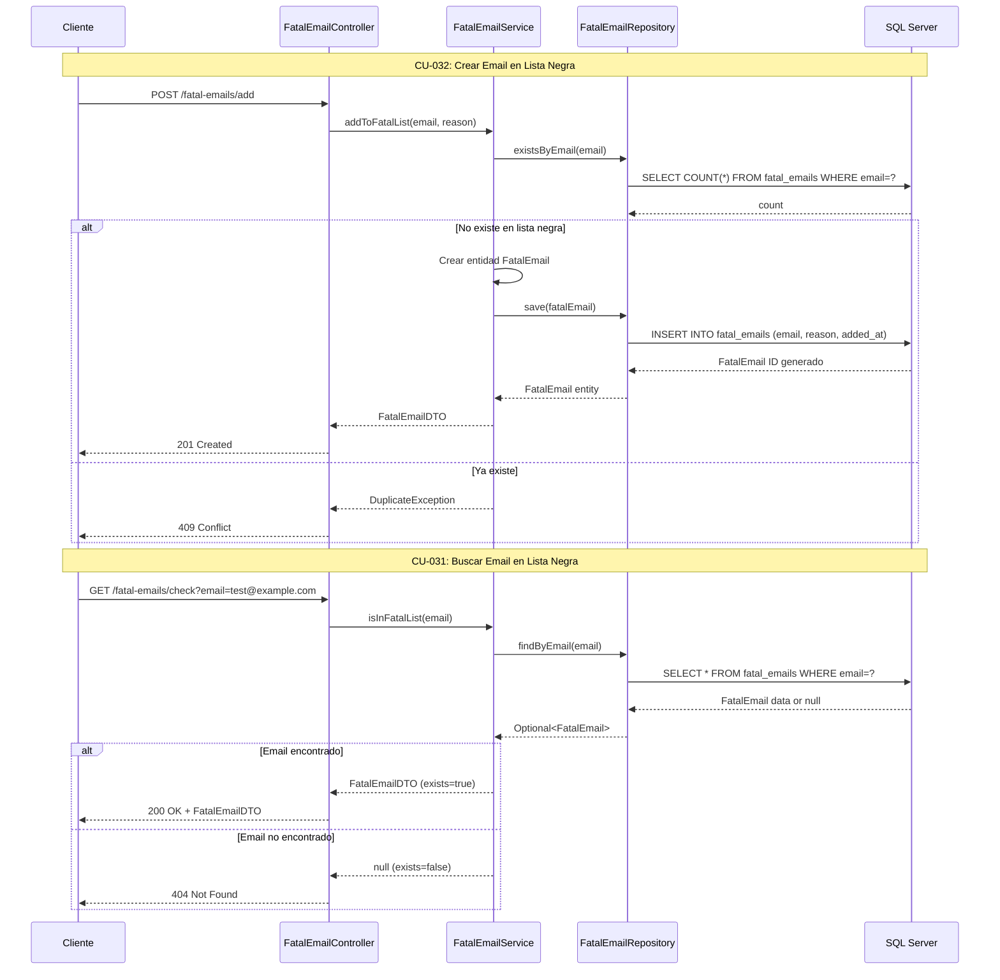

# Módulo 7: Gestión de Lista Negra de Correos Electrónicos

## Casos de Uso
- CU-032: Crear correo electrónico en lista negra
- CU-031: Buscar correo electrónico en lista negra

## Diagrama de Secuencia

