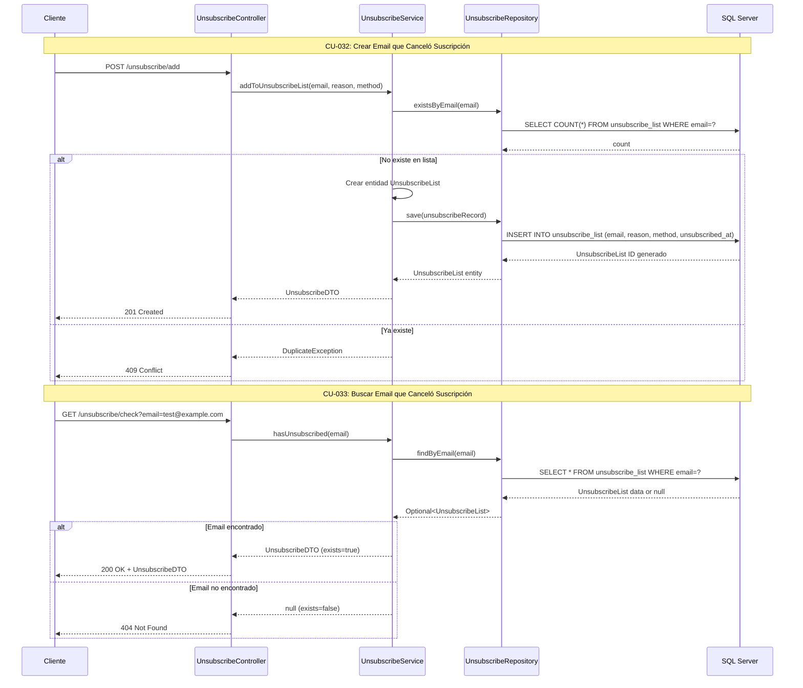

# Módulo 8: Gestión de Lista de Cancelación de Suscripciones

## Casos de Uso
- CU-032: Crear correo electrónico que canceló su suscripción
- CU-033: Buscar correo electrónico que canceló su suscripción

## Diagrama de Secuencia

