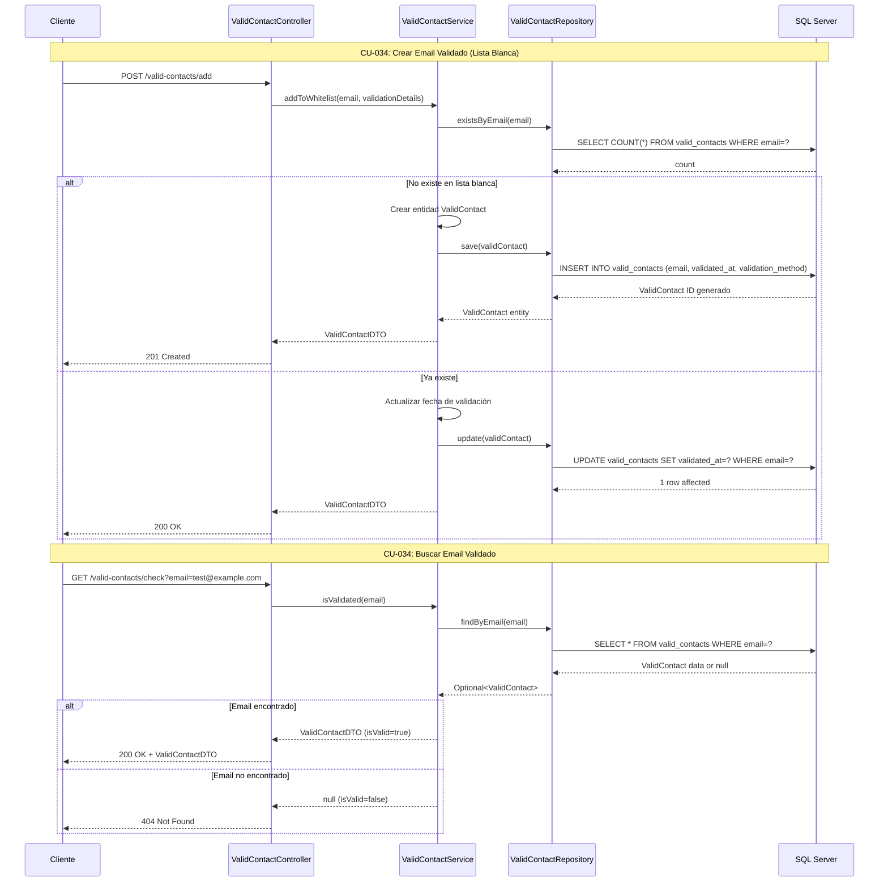

# Módulo 9: Gestión de Lista Blanca de Correos Electrónicos

## Casos de Uso
- CU-034: Crear correo electrónico que pasó todas sus validaciones
- CU-034: Buscar correo electrónico que pasó todas sus validaciones

## Diagrama de Secuencia

